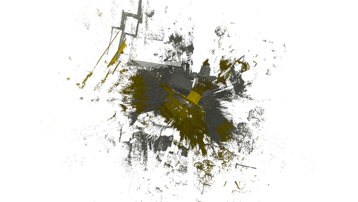

# GH-ICP：Iterative Closest Point algorithm with global optimal matching and hybrid metric 
GH-ICP is a robust coarse-to-fine pairwise point cloud registration method. 

Two key innovative points over ICP are: 

1. Global optimal matching (Using Bipartite Graph and KM algorithm)

2. Hybrid metrics (Using Euclidean distance and feature distance at the same time)

The earlier conference version of GH-ICP is called Iterative Global Similarity Point (IGSP).

To highlight two key innovative points of the algorithm, we renamed IGSP as GH-ICP.

### Demo

##### ETH TLS Dataset
 

##### WHU TLS Dataset
 

##### More
 

### Principle

 
 
 
### [Paper](https://ieeexplore.ieee.org/abstract/document/8490968) 

If you find our work useful in your research, please consider citing:
        
        @INPROCEEDINGS{yue2018igsp,    
          author={Yue, Pan and Bisheng, Yang and Fuxun, Liang and Zhen, Dong},
          booktitle = {2018 International Conference on 3D Vision (3DV)},
          title={Iterative Global Similarity Points: A robust coarse-to-fine integration solution for pairwise 3D point cloud registration},
          year={2018}
        }

#### original version available on Windows.
Compiled with Visual Studio 12 2013 Win64 Release / Debug Passed, see [former release](https://github.com/YuePanEdward/GH-ICP/releases)


#### now available on Linux (passed on ubuntu 16.04)

### How to use 


1. Install dependent 3rd libraries 

[PCL(>=1.7)](https://github.com/PointCloudLibrary/pcl), [LibLas(Optional for las data IO)](https://github.com/libLAS/libLAS)


2. Compile
```
mkdir build
cd build
cmake ..
make 
```

3. Run
```
cd ..
# configure the script/run.sh file for editting the data path and key parameters
sh script/run.sh
```

4. Parameter configuration 

```
#./script/run.sh

#parameters setting example for large scale (100m+) TLS data
using_feature=B;              # Feature selection [ B: BSC, F: FPFH, R: RoPS, N: register without feature ]
corres_estimation_method=K;   # Correspondence estimation by [ K: Bipartite graph min weight match using KM, N: Nearest Neighbor, R: Reciprocal NN ]

downsample_resolution=0.1;    # Raw data downsampling voxel size, just keep one point in the voxel  
neighborhood_radius=0.5;      # Curvature estimation / feature encoding radius
curvature_non_max_radius=1.5; # Keypoint extraction based on curvature: non max suppression radius 
weight_adjustment_ratio=1.1;  # Weight would be adjusted if the IoU between expected value and calculated value is beyond this value
weight_adjustment_step=0.1;   # Weight adjustment for one iteration
registration_dof=6;           # Degree of freedom of the transformation [ 4: TLS with leveling, 6: arbitary ]
appro_overlap_ratio=0.6;      # Estimated approximate overlapping ratio of two point cloud 

launch_realtime_viewer=1;     # Launch the realtime registration viewer during registration or not (1: Launch, 0: Not launch)

```

5. Data preparation

You can test on the online available point cloud data and registration dataset such as [WHU TLS Registration Dataset](http://3s.whu.edu.cn/ybs/en/benchmark.htm), [ETH PRS TLS Registration Dataset](https://prs.igp.ethz.ch/research/completed_projects/automatic_registration_of_point_clouds.html), [ETH ASL Robotics Registration Dataset](https://projects.asl.ethz.ch/datasets/doku.php?id=laserregistration:laserregistration), [3D Match](http://3dmatch.cs.princeton.edu/), [Robotic 3D Scan Repository](http://kos.informatik.uni-osnabrueck.de/3Dscans/), etc. 

You may apply the [format transform tool](https://github.com/YuePanEdward/Pointcloud_Format_Transformer) to get the data ready for registration.

You can also use your own data and edit the data path in the shell file. Four formats of point cloud data are available (*.pcd, *.las, *.ply, *.txt) for IO.

```
#./script/run.sh

#data path
target_point_cloud_path=...
source_point_cloud_path=...
output_point_cloud_path=...

```

6. Analysis

Some other well-known automatic registration algorithms are also provided in this repo. and you may apply them as reference.


#### Other Reference

If you find the Binary Shape Context (BSC) feature used in this repo. useful in your research, please consider citing:

```
@article{dong2017novel,
  title={A novel binary shape context for 3D local surface description},
  author={Dong, Zhen and Yang, Bisheng and Liu, Yuan and Liang, Fuxun and Li, Bijun and Zang, Yufu},
  journal={ISPRS Journal of Photogrammetry and Remote Sensing},
  volume={130},
  pages={431--452},
  year={2017},
  publisher={Elsevier}
}
```

