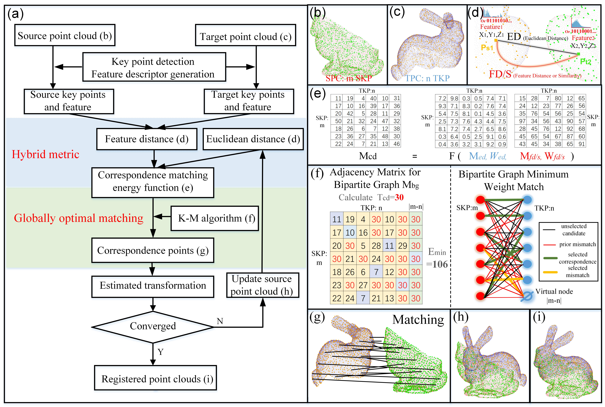

# GH-ICP：Iterative Closest Point algorithm with global optimal matching and hybrid metric 
GH-ICP is a robust coarse-to-fine pairwise point cloud registration method. 

Two key innovative points over ICP are: 

1. Global optimal matching (Using Bipartite Graph and KM algorithm)

2. Hybrid metrics (Using Euclidean distance and feature distance at the same time)

The earlier conference version of GH-ICP is called Iterative Global Similarity Point (IGSP).

After the conference, we have improved the original algorithm on its efficiency and robustness. Besides, we've done more experiments on more datasets. 

To highlight two key innovative points of the algorithm, we renamed IGSP as GH-ICP.

 
 
 
 
### [Video](https://www.youtube.com/watch?v=DZr-8AceSqA)

### [Paper](https://arxiv.org/abs/1808.03899) 
Iterative Global Similarity Points: A robust coarse-to-fine integration solution for pairwise 3D point cloud registration, Yue Pan, Bisheng Yang, Fuxun Liang, Zhen Dong, Accepted by 3DV-2018 

### Citation
If you find our work useful in your research, please consider citing:
        
        @INPROCEEDINGS{yue2018igsp,    
          author={Yue, Pan and Bisheng, Yang and Fuxun, Liang and Zhen, Dong},
          booktitle = {2018 International Conference on 3D Vision (3DV)},
          title={Iterative Global Similarity Points: A robust coarse-to-fine integration solution for pairwise 3D point cloud registration},
          year={2018}
        }

### [Poster](https://github.com/YuePanEdward/YuePanEdward.github.io/blob/master/assets/3DVposter.pdf)

### Now available on Windows.
Compiled with Visual Studio 12 2013 Win64 Release / Debug

> PCL 1.8+ Required

> OpenCV 2.4+ Required

> LibLas Required

> VTK 6.2+ Required

> Boost 1.59+ Requried

### How to use
> 1.Input Target cloud

> 2.Input Source cloud

> 3.Input parameter list or directly use the GH-ICP default settings for pairwise large-scale TLS registration 

> 4.Estimate the approximate overlapping rate (IoU) of the point cloud pair

### Parameter list 
Take the TLS (outdoor buildings) registration parameter setting as an example.

> 0.05

> 1.5

> 0.6

> 0.6

> 30

> 1

> 2.5

> 1.0

> 1.0

> 6

> 0.01

> 1.1

> 0.1

> 0.01

> 0.01

> 1

> 1

> 0

### Notification

> 1  resolution of voxel downsampling (unit:m)

> 2  [key parameter] keypoint_non_max_r (unit:m) (Keypoint detection's non-max supression value)  

> 3  feature_r (feature calulation radius, unit:m) 

> 4  [key parameter] keypoint_max_ratio (the max curvature for keypoint detection, the larger this value is, the more keypoints would be)

> 5  keypoint_min_num (the minimum surrounding points for keypoint detection)

> 6  scale (a scale parameter to balance Euclidean and Feature distance. For example, if actual Euclidean distance between two points is d1, then the distance used to calculate energy function would be d1*scale)

> 7  penalty_pre (the first weight paramter p1 in the original paper, the larger this value is, the less points would be matched at the very beginning)

> 8  penalty_ED (the second weight paramter p2 in the original paper, the smaller this value is, the less points would be matched)

> 9  penalty_FD (the third weight paramter p3 in the original paper, the smaller this value is, the less points would be matched)

> 10  m (the iteration rate parameter which control the changing rate of the weight of Euclidean and Feature Distance)

> 11 km-eps (the terminal threshold of KM algorithm, the larger this value is, the quicker the algorithm would be. However, if this value is too large, the accuracy of this algorithm would be sacrificed)

> 12 weight_adjustment_ratio (Weight would be adjusted if the IoU between expected value and calculated value is beyond this value)   

> 13 weight_adjustment_step (Weight adjustment for one iteration) 

> 14 converge_t  (the iterative termination condition for translation, unit: m)

> 15 converge_r  (the iterative termination condition for rotation, unit: degree. Only when these two conditions are met at the same time， the algorithm would be seemed as converged)

> 16 [key parameter] match method (If this value is 1, KM algorithm would be adopted to calculate the correspondence. If this value is 0, traditional nearest neighbor would be used)

> 17 [key parameter] feature option (If this value is 1, BSC[1] feature would be extracted and used for the feature distance calculation. If this value is 2, FPFH feature would be extracted and used for the feature distance calculation. If this value is 0, this algorithm would not consider the hybrid metrics and directly use Euclidean metrics instead.)

> 18 output or not output (If this value is 1, then the point cloud of every four iterations would be output. Or there would be no output except for the last one)

### Tips

1. You can choose from GH-ICP,G-ICP,H-ICP,Classic-ICP.
> GH-ICP: parameter16 = 1 parameter17 = 1 or 2

> H-ICP: parameter16 = 0 parameter17 = 1 or 2

> G-ICP: parameter16 = 1 parameter17 = 0

> Classic ICP: parameter16 = 0 parameter17 = 0
   
   According to the experiments, GH-ICP has the best accuracy, robustness and applicability. However its limited efficiency o(n^3) make it not suitable for engineering application. Then you can choose to use H-ICP, which is faster o(n^2) but less robust.

### Reference

[1]BSC feature: Please refer to our previous article：Dong, Z., Yang, B., Liu, Y., Liang, F., Li, B., & Zang, Y., 2017. A novel binary shape context for 3d local surface description. Isprs Journal of Photogrammetry & Remote Sensing, 130, 431-452.
